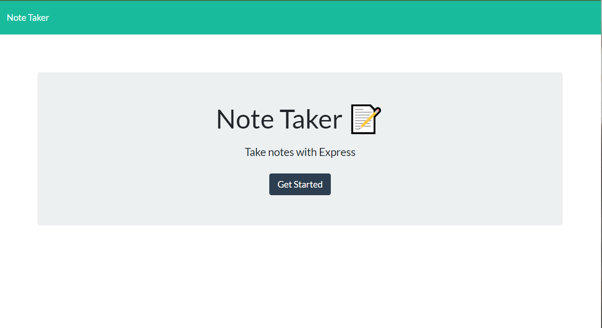
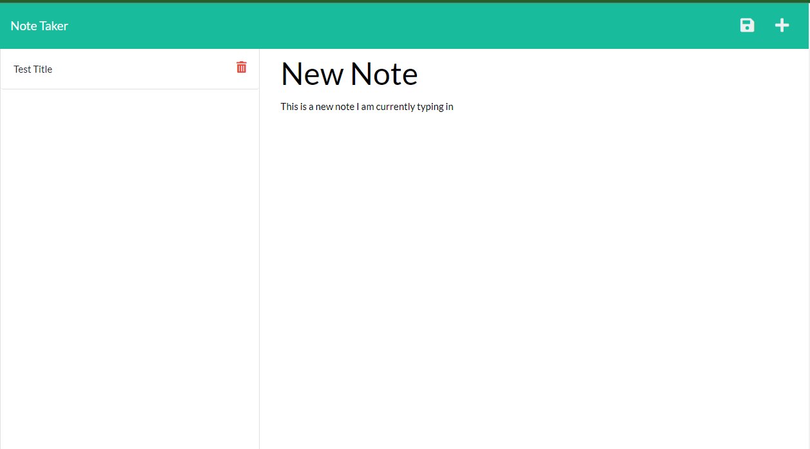
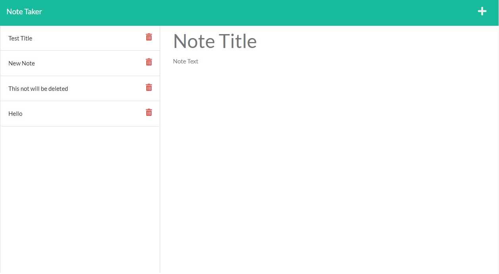
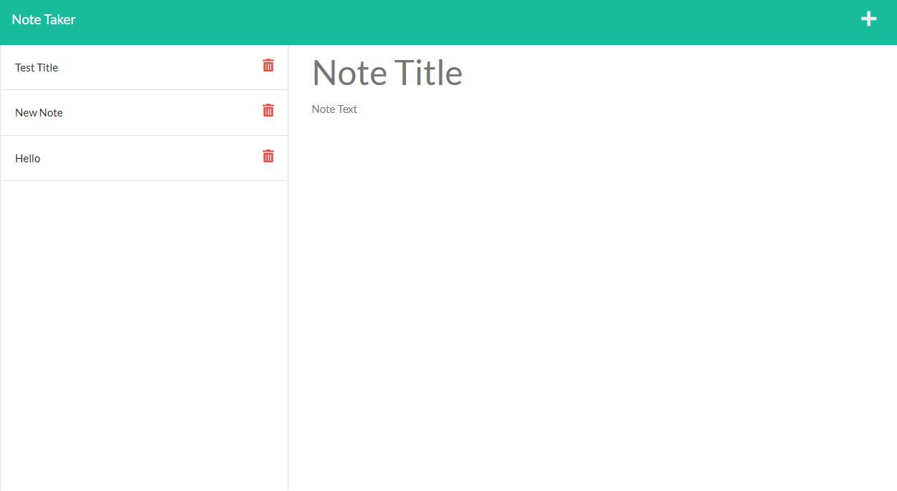

# Note Taker

## Table of Contents

- [Description](#Description)
- [Usage](#Usage)
- [Application Screenshots](#application-screenshots)
- [Application Links](#application-links)

## Description
#### User Story 

AS A small business owner
I WANT to be able to write and save notes
SO THAT I can organize my thoughts and keep track of tasks I need to complete

#### Acceptance Criteria

GIVEN a note-taking application
WHEN I open the Note Taker
THEN I am presented with a landing page with a link to a notes page
WHEN I click on the link to the notes page
THEN I am presented with a page with existing notes listed in the left-hand column, plus empty fields to enter a new note title and the note’s text in the right-hand column
WHEN I enter a new note title and the note’s text
THEN a Save icon appears in the navigation at the top of the page
WHEN I click on the Save icon
THEN the new note I have entered is saved and appears in the left-hand column with the other existing notes
WHEN I click on an existing note in the list in the left-hand column
THEN that note appears in the right-hand column
WHEN I click on the Write icon in the navigation at the top of the page
THEN I am presented with empty fields to enter a new note title and the note’s text in the right-hand column

## Usage

This application has been deployed to Heroku, no installation is required. You can click on the Heroku Deployment link below to start using the app! You will be brought to the homepage shown in the screenshots below. You can click 'Get Started' and it will take you to the notes page. Once there, there will already be an example note that is on the left side, as shown in the second screenshot. This note can be deleted if you wish to start with a clean notes page. Once you add a title and body to a new note you can click the save button on the top right shaped like a floppy disk. 

## Application Screenshots

## Application Links

[GitHub](https://github.com/VictorMendez96/note-taker)

[Heroku Deployment](https://agile-cove-29017.herokuapp.com/)